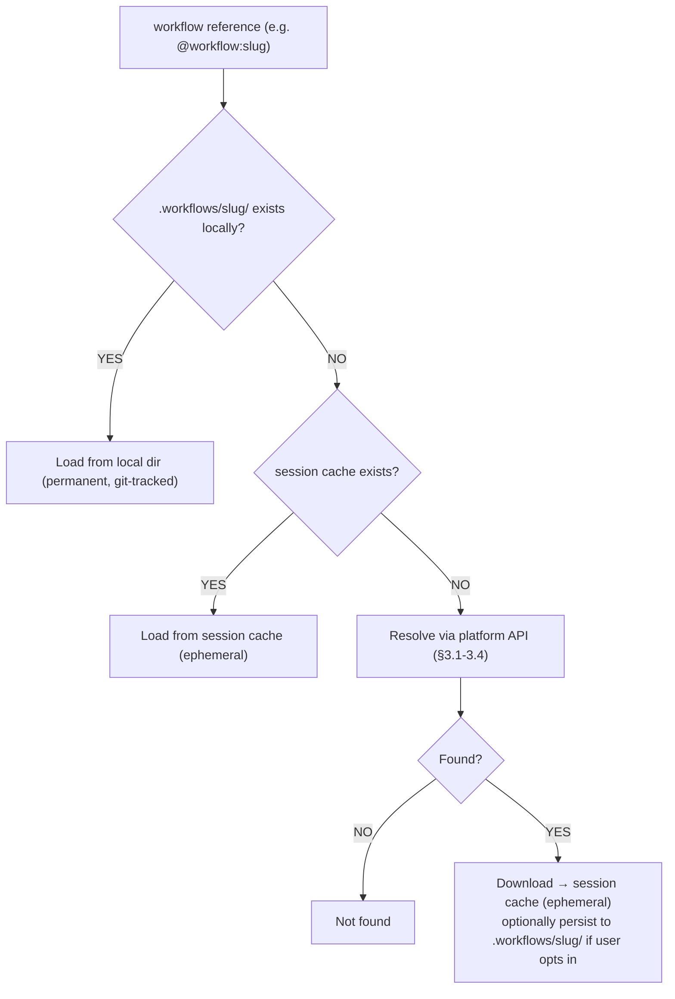

# Workflow Protocol — Technical Specification

**Status**: MVP, stable. This document is the source of truth for the wire format and API contracts. Backward-incompatible changes will be called out explicitly and versioned.

## 1. Wire Format: SKILL.md

A workflow is a single UTF-8 text file named `SKILL.md`, consisting of:

1. An optional YAML frontmatter block, delimited by `---` lines.
2. A markdown body — the instructions given to the agent.

```markdown
---
name: tdd
description: Test-driven development methodology
author: mattpocock
version: 1.0.0
tags: [testing, methodology]
---

# TDD Workflow

1. Write a failing test FIRST
2. Write the minimum code to make it pass
3. Refactor only when green
4. Repeat
```

### Frontmatter fields

| Field | Required | Type | Description |
|-------|----------|------|-------------|
| `name` | Yes | string | Unique identifier / slug seed. Lowercase, hyphenated (e.g. `tdd`, `code-review`). |
| `description` | Yes | string | One-line summary shown in listings and search results. Keep under ~120 chars. |
| `author` | No | string | GitHub username or handle of the workflow's creator. |
| `version` | No | string (semver) | Version of the workflow content, e.g. `1.0.0`. Defaults to unset/latest. |
| `tags` | No | string[] | Free-form tags for discovery/filtering (e.g. `["diagrams", "animated"]`). |

Unknown frontmatter fields MUST be ignored by consumers (forward compatibility) — never rejected.

If frontmatter is missing entirely, the file is still a valid workflow; `name`/`description` fall back to the file path / first heading, but this is discouraged for anything intended to be catalog-listed.

### Body

Everything after the closing `---` is free-form markdown. There is no imposed structure beyond "write instructions an agent can follow." Conventionally: a top-level heading, then numbered or bulleted steps. Code blocks, tables, and Mermaid diagrams are all valid and commonly used.

## 2. Directory Structure (multi-file workflows)

```
my-workflow/
  SKILL.md              # Required — the instructions (see §1)
  scripts/              # Optional — helper scripts the agent may execute
  references/            # Optional — reference docs, examples, lookup data
  templates/             # Optional — boilerplate files the agent may copy
```

Only `SKILL.md` is required. Consumers that only support "fetch a single markdown file" (the minimal integration path in `README.md`) MAY ignore `scripts/`, `references/`, and `templates/` entirely — those directories are for agents with file-system/tool access (e.g. AdaL, Claude Code, Cursor) that can read and run supporting files from a cloned or synced directory.

## 3. API Contracts

**Base URL:** `https://adal.sylph.ai`

All endpoints return `application/json`. All GET endpoints below are public — no authentication required. Responses always include a top-level `"success": boolean` field; on failure, an `"error"` string field is included instead of the endpoint-specific payload.

### 3.1 `GET /api/workflows/inventory`

List all publicly indexed workflows.

**Query parameters:** none required (pagination/filtering params may be added in a backward-compatible way in the future).

**Response:**
```json
{
  "success": true,
  "count": 42,
  "inventory": [
    {
      "slug": "sylphai-inc-glowmotion",
      "name": "glowmotion",
      "description": "Create premium animated technical diagrams...",
      "author": "Aria068",
      "github_repo": "SylphAI-Inc/skills",
      "github_path": "skills/glowmotion",
      "github_skill_path": "gh:SylphAI-Inc/skills/skills/glowmotion",
      "tags": ["diagrams", "animated"]
    }
  ]
}
```

| Field | Type | Description |
|-------|------|-------------|
| `slug` | string | Stable, globally unique identifier for this workflow. Used in `resolve` and `content` endpoints. |
| `name` | string | The `name` from the SKILL.md frontmatter. |
| `description` | string | The `description` from the SKILL.md frontmatter. |
| `author` | string | Author, if present. |
| `github_repo` | string | `owner/repo` this workflow is indexed from (GitHub-sourced workflows only). |
| `github_path` | string | Path within the repo to the workflow directory. |
| `github_skill_path` | string | Canonical `gh:owner/repo/path` reference form, usable directly with `@workflow:` / `/workflow`. |
| `tags` | string[] | Tags, if present. |

Platform-created (non-GitHub) workflows omit the `github_*` fields.

### 3.2 `GET /api/workflows/resolve/{slug}`

Resolve a slug to its metadata and source location, without fetching the full content. Useful for checking existence/freshness before downloading.

**Response:**
```json
{
  "success": true,
  "slug": "glowmotion",
  "source": "github",
  "github_skill_path": "gh:SylphAI-Inc/skills/skills/glowmotion",
  "metadata": {
    "name": "glowmotion",
    "description": "Create premium animated technical diagrams...",
    "author": "Aria068",
    "version": null,
    "tags": ["diagrams", "animated"]
  }
}
```

`source` is `"github"` or `"platform"`. On a miss (unknown slug), respond `404` with `{"success": false, "error": "not_found"}`.

### 3.3 `GET /api/workflows/{slug}/content`

Fetch the full raw `SKILL.md` content for a listed slug.

**Response:**
```json
{
  "success": true,
  "slug": "glowmotion",
  "content": "---\nname: glowmotion\ndescription: Create premium animated diagrams\n---\n\n# Glowmotion\n\n...",
  "source": "github"
}
```

`content` is the raw, unmodified text of `SKILL.md` (frontmatter included). Consumers should treat it as opaque markdown text and parse the frontmatter themselves if needed.

### 3.4 `GET /api/workflows/content?github_url=<owner/repo/path>`

Fetch a `SKILL.md` from any public GitHub path, whether or not it's indexed in the catalog. This is the escape hatch for the long tail — any public repo with a `SKILL.md` works immediately, with no submission or indexing step.

**Query parameter:**
- `github_url` — format `owner/repo/path/to/skill-dir` (no scheme, no `github.com/`), e.g. `SylphAI-Inc/skills/skills/glowmotion`.

**Response:** identical shape to §3.3, with `"source": "github"`.

If the path does not contain a `SKILL.md`, respond `404` with `{"success": false, "error": "not_found"}`.

### 3.5 `POST /api/workflows/create`

Create a platform-hosted (DB-backed) workflow. **Requires authentication.**

**Request:**
```json
{
  "name": "my-workflow",
  "description": "One-line summary",
  "content": "Full instructions as plain markdown/text"
}
```

**Response:**
```json
{
  "success": true,
  "slug": "my-workflow-x7f2",
  "url": "https://adalagent.ai/workflows/my-workflow-x7f2"
}
```

Platform-created workflows are markdown-only (no `scripts/`/`references/` support) as an intentional MVP simplification for non-technical authors. See `README.md` → Contributing for the GitHub-based alternative when full skill power is needed.

## 4. Authentication

- All read endpoints (`inventory`, `resolve`, `content`) are **public, unauthenticated**.
- `POST /api/workflows/create` requires a valid session (Clerk-authenticated) since it writes to the platform's workflow catalog.
- No API key is required or issued for read access — this is intentional. The protocol's minimal-integration path (curl → SKILL.md → agent context) must work with zero setup.

## 5. Rate Limits

- Unauthenticated GET endpoints are capped at **100 requests/minute** per client IP.
- Exceeding the limit returns `429 Too Many Requests` with:
  ```json
  {"success": false, "error": "rate_limited", "retry_after_seconds": 42}
  ```
- There is no rate limit workaround via authentication for read endpoints — the limit is generous enough for normal agent usage (fetch-once-per-invocation), and is meant to prevent abusive scraping, not to gate legitimate integrations. If your use case needs sustained high-volume access, open an issue.

## 6. Caching Strategy

- **Server-side**: GitHub-sourced content is cached at the API layer with a short TTL to avoid hitting GitHub's own rate limits on every request; the catalog inventory is refreshed on an indexing cadence, not on every read.
- **Client-side (recommended)**: Consumers SHOULD cache fetched `SKILL.md` content for the duration of a single agent session/task and re-fetch on the next session, rather than re-fetching on every turn. This mirrors the "session cache" tier described in the resolution order below.
- Cached content MAY be stale relative to the upstream GitHub file for the duration of the server-side TTL. There is currently no cache-busting query parameter — if you need guaranteed-fresh content, fetch directly from GitHub's raw content API instead of this protocol's `/content` endpoint.

## 7. Resolution Order (client-side convention)

Agents with local file-system access (AdaL, Claude Code, Cursor, etc.) SHOULD resolve a workflow reference in this order, so that project-local customization always wins and network access is only used when necessary:



1. **Project-local** — check a conventional local directory (e.g. `.workflows/<slug>/`) in the current working directory / repo. Permanent, version-controlled, always wins.
2. **Session cache** — an ephemeral, in-memory or temp-dir cache scoped to the current agent session/task. Cleared when the session ends.
3. **Online (this protocol)** — fall back to the API endpoints in §3. Explicit GitHub paths (`gh:owner/repo/path`) bypass slug resolution and fetch directly.

Agents without file-system access (e.g. a stateless chat completion call) simply skip straight to step 3 on every invocation, or rely on their own caller-side caching.

This resolution order is a **recommendation for a good client implementation**, not a protocol requirement — the only hard requirement is the wire format (§1) and API contracts (§3).

## 8. Error Handling

All error responses use the same envelope:

```json
{"success": false, "error": "<error_code>", "detail": "<human-readable message>"}
```

| `error` code | HTTP status | Meaning |
|--------------|-------------|---------|
| `not_found` | 404 | Slug or GitHub path does not resolve to a `SKILL.md`. |
| `rate_limited` | 429 | Client exceeded the rate limit in §5. |
| `invalid_github_url` | 400 | `github_url` param is malformed (wrong format, missing path segments). |
| `unauthorized` | 401 | Auth required (write endpoints) but missing/invalid credentials. |
| `internal_error` | 500 | Unexpected server-side failure. Safe to retry with backoff. |

Consumers should treat any non-`2xx` response as a failure and fall back gracefully (e.g. skip the workflow, or prompt the user) rather than crashing the calling agent.

## 9. Versioning of this Protocol

This is an MVP. Additive, backward-compatible changes (new optional fields, new endpoints) will not bump a version number. Any breaking change to the wire format or existing endpoint contracts will be announced via this repo's issues/releases before rollout.
