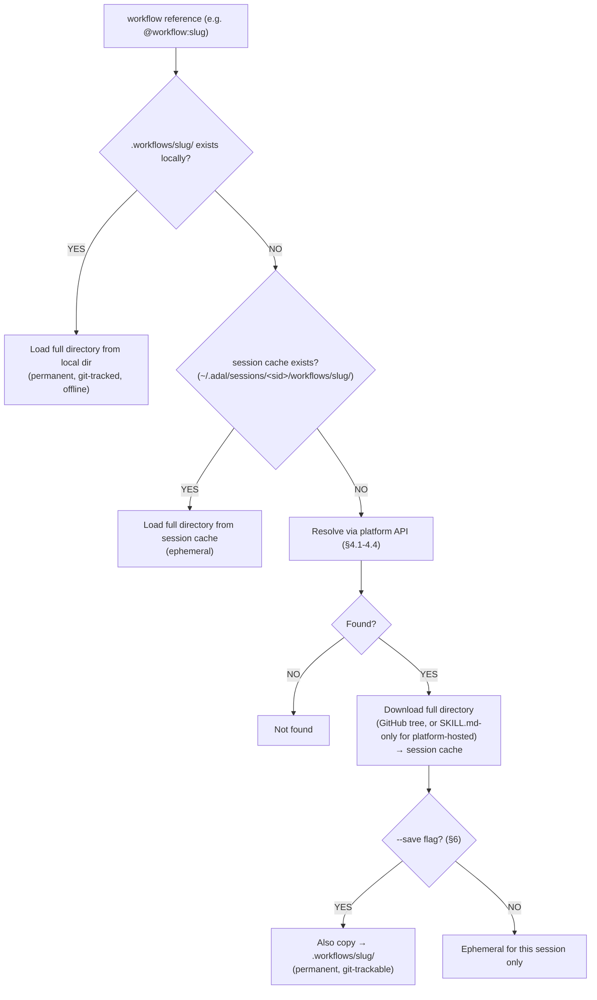

# Workflow Protocol — Technical Specification

**Status**: MVP, stable. This document is the source of truth for the wire format, directory structure, and API contracts. Backward-incompatible changes will be called out explicitly and versioned.

## 1. What a Workflow Is

A workflow is a **directory**, not a single file. `SKILL.md` is the required entrypoint; everything else is optional supporting material:

```
my-workflow/
  SKILL.md              # Required — the instructions (YAML frontmatter + markdown body)
  scripts/               # Optional — helper scripts the agent can execute
  references/             # Optional — reference docs, examples, lookup data
  templates/               # Optional — boilerplate files the agent may copy/fill in
```

Many workflows are just a `SKILL.md` with no supporting directories — that's a perfectly valid, complete workflow. `scripts/`, `references/`, and `templates/` exist for workflows that genuinely need runnable code, lookup data, or boilerplate alongside the instructions. A workflow directory is format-identical to a Claude Code / Cursor / skills.sh skill directory — same shape, different delivery lifecycle (see `README.md` → "How This Relates to Skills").

## 2. Wire Format: SKILL.md

`SKILL.md` is a single UTF-8 text file consisting of:

1. An optional YAML frontmatter block, delimited by `---` lines.
2. A markdown body — the instructions given to the agent.

```markdown
---
name: tdd
description: Test-driven development methodology
author: mattpocock
version: 1.0.0
tags: [testing, methodology]
---

# TDD Workflow

1. Write a failing test FIRST
2. Write the minimum code to make it pass
3. Refactor only when green
4. Repeat
```

### Frontmatter fields

| Field | Required | Type | Description |
|-------|----------|------|-------------|
| `name` | Yes | string | Unique identifier / slug seed. Lowercase, hyphenated (e.g. `tdd`, `code-review`). |
| `description` | Yes | string | One-line summary shown in listings, search results, and index-mode previews. Keep under ~120 chars. |
| `author` | No | string | GitHub username or handle of the workflow's creator. |
| `version` | No | string (semver) | Version of the workflow content, e.g. `1.0.0`. Defaults to unset/latest. |
| `tags` | No | string[] | Free-form tags for discovery/filtering (e.g. `["diagrams", "animated"]`). |

Unknown frontmatter fields MUST be ignored by consumers (forward compatibility) — never rejected. `name` + `description` are the only fields loaded in **index mode** (§7) — keep both meaningful on their own, without the body.

If frontmatter is missing entirely, the file is still a valid workflow; `name`/`description` fall back to the file path / first heading, but this is discouraged for anything intended to be catalog-listed.

### Body

Everything after the closing `---` is free-form markdown. There is no imposed structure beyond "write instructions an agent can follow." Conventionally: a top-level heading, then numbered or bulleted steps. Code blocks, tables, and Mermaid diagrams are all valid and commonly used.

## 3. Supporting Directories

| Directory | Purpose | Consumed by |
|-----------|---------|-------------|
| `scripts/` | Executable helper scripts (any language/shell) the agent can run as part of following the instructions | Agents with shell/tool execution access (AdaL, Claude Code, Cursor, etc.) |
| `references/` | Reference documentation, examples, lookup tables the instructions point to | Agents with file-read access; also useful to a human skimming the workflow |
| `templates/` | Boilerplate files the agent copies or fills in as part of the task | Agents with file-write access |

None of these directories are required, and consumers MAY ignore them entirely if they only support the "fetch one markdown file" minimal integration path (§8.1). They matter for consumers that download the **full directory** — which is what AdaL and other file-system-capable agents do by default (§6, "Full load").

## 4. API Contracts

**Base URL:** `https://adal.sylph.ai`

All endpoints return `application/json`. All GET endpoints below are public — no authentication required. Responses always include a top-level `"success": boolean` field; on failure, an `"error"` string field is included instead of the endpoint-specific payload.

### 4.1 `GET /api/workflows/inventory`

List all publicly indexed workflows.

**Response:**
```json
{
  "success": true,
  "count": 42,
  "inventory": [
    {
      "slug": "sylphai-inc-glowmotion",
      "name": "glowmotion",
      "description": "Create premium animated technical diagrams...",
      "author": "Aria068",
      "github_repo": "SylphAI-Inc/skills",
      "github_path": "skills/glowmotion",
      "github_skill_path": "gh:SylphAI-Inc/skills/skills/glowmotion",
      "tags": ["diagrams", "animated"]
    }
  ]
}
```

| Field | Type | Description |
|-------|------|-------------|
| `slug` | string | Stable, globally unique identifier for this workflow. Used in `resolve` and `content` endpoints. |
| `name` | string | The `name` from the SKILL.md frontmatter. |
| `description` | string | The `description` from the SKILL.md frontmatter. |
| `author` | string | Author, if present. |
| `github_repo` | string | `owner/repo` this workflow is indexed from (GitHub-sourced workflows only). |
| `github_path` | string | Path within the repo to the **workflow directory** (not just SKILL.md). |
| `github_skill_path` | string | Canonical `gh:owner/repo/path` reference form — resolves the whole directory, usable directly with `@workflow:` / `/workflow`. |
| `tags` | string[] | Tags, if present. |

Platform-created (non-GitHub) workflows omit the `github_*` fields — they are markdown-only, with no directory (§9).

### 4.2 `GET /api/workflows/resolve/{slug}`

Resolve a slug to its metadata and source location, without downloading content. This is the step a file-system-capable client uses to get `github_skill_path`/`github_repo`+`github_path` so it can then fetch the **full directory** (SKILL.md + scripts/references/templates) directly from GitHub, rather than only the SKILL.md text via §4.3.

**Response:**
```json
{
  "success": true,
  "slug": "glowmotion",
  "source": "github",
  "github_repo": "SylphAI-Inc/skills",
  "github_path": "skills/glowmotion",
  "github_skill_path": "gh:SylphAI-Inc/skills/skills/glowmotion",
  "metadata": {
    "name": "glowmotion",
    "description": "Create premium animated technical diagrams...",
    "author": "Aria068",
    "version": null,
    "tags": ["diagrams", "animated"]
  }
}
```

`source` is `"github"` or `"platform"`. On a miss (unknown slug), respond `404` with `{"success": false, "error": "not_found"}`.

### 4.3 `GET /api/workflows/{slug}/content`

Fetch the raw `SKILL.md` text for a listed slug. **This endpoint returns the entrypoint instructions only — it does not return `scripts/`, `references/`, or `templates/`.** It exists for the minimal-integration path (§8.1): agents that just need instructions in context, with no directory/file handling.

**Response:**
```json
{
  "success": true,
  "slug": "glowmotion",
  "content": "---\nname: glowmotion\ndescription: Create premium animated diagrams\n---\n\n# Glowmotion\n\n...",
  "source": "github"
}
```

`content` is the raw, unmodified text of `SKILL.md` (frontmatter included). Consumers should treat it as opaque markdown text and parse the frontmatter themselves if needed.

**To get the full directory instead**, resolve the slug first (§4.2) to get `github_repo`/`github_path`, then fetch that path's tree directly from GitHub (e.g. `git clone`, the GitHub Contents API, or `codeload.github.com`) — see §6/§8.2 for the full-load flow AdaL uses.

### 4.4 `GET /api/workflows/content?github_url=<owner/repo/path>`

Fetch just the `SKILL.md` from any public GitHub path, whether or not it's indexed in the catalog — the escape hatch for the long tail. Same single-file limitation as §4.3 applies.

**Query parameter:**
- `github_url` — format `owner/repo/path/to/skill-dir` (no scheme, no `github.com/`), e.g. `SylphAI-Inc/skills/skills/glowmotion`.

**Response:** identical shape to §4.3, with `"source": "github"`.

If the path does not contain a `SKILL.md`, respond `404` with `{"success": false, "error": "not_found"}`.

### 4.5 `POST /api/workflows/create`

Create a platform-hosted (DB-backed) workflow. **Requires authentication.** Platform-created workflows are markdown-only — no `scripts/`/`references/`/`templates/` support (§9).

**Request:**
```json
{
  "name": "my-workflow",
  "description": "One-line summary",
  "content": "Full instructions as plain markdown/text"
}
```

**Response:**
```json
{
  "success": true,
  "slug": "my-workflow-x7f2",
  "url": "https://adalagent.ai/workflows/my-workflow-x7f2"
}
```

## 5. Authentication

- All read endpoints (`inventory`, `resolve`, `content`) are **public, unauthenticated**.
- `POST /api/workflows/create` requires a valid session (Clerk-authenticated) since it writes to the platform's workflow catalog.
- No API key is required or issued for read access — this is intentional. The protocol's minimal-integration path (curl → SKILL.md → agent context) must work with zero setup.

## 6. Consumption Modes

A client resolving a workflow reference (e.g. `@workflow:<id>`) chooses one of three modes:

| Mode | Trigger | Behavior |
|------|---------|----------|
| **Full load** (default) | plain `@workflow:<id>` / `/workflow <id>` | Download the entire directory (SKILL.md + scripts/references/templates) into the resolution tier's storage (§7); inject `SKILL.md` into the agent's context; make scripts/references available on disk for the agent to read/execute. |
| **Index mode** | `@workflow:<id> --index` | Load only the YAML frontmatter (`name` + `description`) into context — a cheap preview. The agent decides whether the workflow is relevant, and only then fetches the full `SKILL.md`/directory. Useful when surfacing many candidate workflows without spending context budget on all of them upfront. |
| **Saved mode** | `@workflow:<id> --save` | Same as full load, but the downloaded directory is also persisted to `.workflows/<id>/` in the project (git-trackable, available offline in future sessions) instead of only living in the ephemeral session cache. |

Consumers that only support the minimal single-file integration (§8.1) effectively only implement a stripped-down "full load" — content-only, no directory, no local persistence tier.

## 7. Resolution Order (client-side convention)

Agents with local file-system access (AdaL, Claude Code, Cursor, etc.) SHOULD resolve a workflow reference in this order, so that project-local customization always wins and network access is only used when necessary:



1. **Project-local** — check `.workflows/<slug>/` in the current working directory / repo. Full directory, permanent, version-controlled, always wins, works offline.
2. **Session cache** — `~/.adal/sessions/<session-id>/workflows/<slug>/`, an ephemeral cache scoped to the current agent session. Cleared when the session ends (unless promoted via `--save`).
3. **Online (this protocol)** — fall back to the API endpoints in §4. Explicit GitHub paths (`gh:owner/repo/path`) bypass slug resolution and fetch the directory directly.

Agents without file-system access (e.g. a stateless chat completion call) simply skip straight to step 3 on every invocation, using the content-only endpoints (§4.3/§4.4), and rely on their own caller-side caching for the equivalent of the session-cache tier.

This resolution order is a **recommendation for a good client implementation**, not a protocol requirement — the only hard requirements are the directory/wire format (§1-§2) and API contracts (§4).

## 8. For Agent Builders

### 8.1 Minimal integration (5 minutes) — instructions only

1. Fetch the SKILL.md content via the API:
   ```bash
   curl -s https://adal.sylph.ai/api/workflows/<slug>/content | jq -r '.content'
   ```
2. Inject the returned `content` into the agent's context.
3. Done. No directory handling, no scripts/references support.

### 8.2 Full integration (1 hour) — full directory support

1. Add a `/workflow <slug>` (or `@workflow:<slug>`) command to your agent.
2. Resolve the slug first: `GET /api/workflows/resolve/{slug}` (§4.2) to get `github_repo` + `github_path` (or a direct `github_skill_path`).
3. Fetch the **full directory** from that GitHub path (clone, GitHub Contents API, or download-and-extract a tarball) — this is what gets you `scripts/`, `references/`, and `templates/`, not just `SKILL.md`.
4. Inject `SKILL.md`'s content into the agent's context; make the rest of the directory available on disk for the agent's file-read/execute tools.
5. For unlisted skills, use `github_url=<path>` directly against `resolve`/`content` (§4.4) instead of a slug.
6. Implement the resolution order in §7 if you want local-first behavior (project `.workflows/`, session cache) rather than fetching fresh every time.

Platform-hosted workflows (`source: "platform"`) never have a directory to fetch — `content` from §4.3 is the entire workflow for those.

## 9. Platform-Hosted Workflows Are Markdown-Only

Workflows created via `POST /api/workflows/create` (or the `adalagent.ai/workflows/create` UI) are stored as a single markdown string in the platform database — there is no directory, no `scripts/`/`references/`/`templates/` support for this creation path. This is an intentional MVP simplification aimed at non-technical authors who just want to publish a prompt/playbook without touching GitHub. If a workflow needs the full directory power, author it on GitHub (§8, `CONTRIBUTING.md` → Option A) instead.

## 10. Rate Limits

- Unauthenticated GET endpoints are capped at **100 requests/minute** per client IP.
- Exceeding the limit returns `429 Too Many Requests` with:
  ```json
  {"success": false, "error": "rate_limited", "retry_after_seconds": 42}
  ```
- There is no rate limit workaround via authentication for read endpoints — the limit is generous enough for normal agent usage (fetch-once-per-invocation), and is meant to prevent abusive scraping, not to gate legitimate integrations. If your use case needs sustained high-volume access, open an issue.

## 11. Caching Strategy

- **Server-side**: GitHub-sourced content is cached at the API layer with a short TTL to avoid hitting GitHub's own rate limits on every request; the catalog inventory is refreshed on an indexing cadence, not on every read.
- **Client-side (recommended)**: Consumers SHOULD cache a fetched workflow (directory or content) for the duration of a single agent session/task and re-fetch on the next session, rather than re-fetching on every turn — this is exactly the session-cache tier in §7.
- Cached content MAY be stale relative to the upstream GitHub directory for the duration of the server-side TTL. There is currently no cache-busting query parameter — if you need guaranteed-fresh content, fetch directly from GitHub's own APIs instead of this protocol's endpoints.

## 12. Error Handling

All error responses use the same envelope:

```json
{"success": false, "error": "<error_code>", "detail": "<human-readable message>"}
```

| `error` code | HTTP status | Meaning |
|--------------|-------------|---------|
| `not_found` | 404 | Slug or GitHub path does not resolve to a workflow directory with a `SKILL.md`. |
| `rate_limited` | 429 | Client exceeded the rate limit in §10. |
| `invalid_github_url` | 400 | `github_url` param is malformed (wrong format, missing path segments). |
| `unauthorized` | 401 | Auth required (write endpoints) but missing/invalid credentials. |
| `internal_error` | 500 | Unexpected server-side failure. Safe to retry with backoff. |

Consumers should treat any non-`2xx` response as a failure and fall back gracefully (e.g. skip the workflow, or prompt the user) rather than crashing the calling agent.

## 13. Versioning of this Protocol

This is an MVP. Additive, backward-compatible changes (new optional fields, new endpoints) will not bump a version number. Any breaking change to the wire format, directory structure, or existing endpoint contracts will be announced via this repo's issues/releases before rollout.
