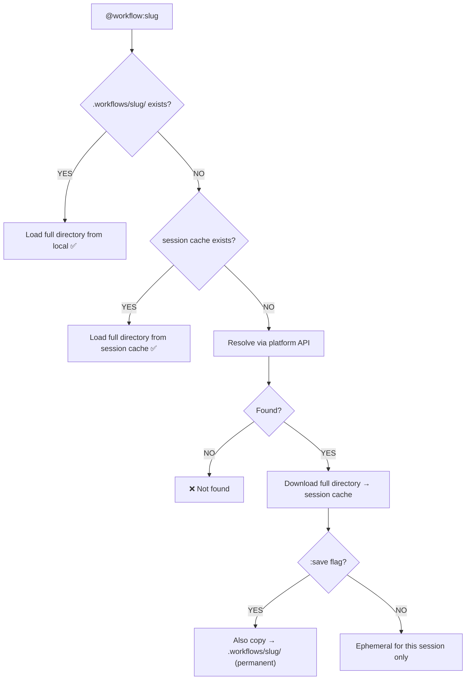

# AgentWorkflows

Workflows are a lightweight protocol built on top of the existing Skills format (SKILL.md). Same file, simpler lifecycle — no install, no system prompt footprint, load on demand, gone after. Designed to make agent instructions accessible to everyone, not just technical users.

## What is a Workflow?

A workflow is a **directory** — not just a single file:

```
glowmotion/
  SKILL.md              # Required — the instructions (with YAML frontmatter)
  scripts/               # Optional — helper scripts the agent can run
  references/            # Optional — reference docs, examples, lookup data
  templates/              # Optional — template files to copy/fill in
```

`SKILL.md` is the entrypoint: a markdown document with instructions telling an AI agent how to perform a task. `scripts/`, `references/`, and `templates/` are optional supporting material an agent with file/tool access can read or execute alongside the instructions. Many workflows are just a `SKILL.md` on its own — the directory structure only matters once a workflow needs more than plain instructions.

```markdown
---
name: tdd
description: Test-driven development methodology
author: mattpocock
---

# TDD Workflow

1. Write a failing test FIRST
2. Write the minimum code to make it pass
3. Refactor only when green
4. Repeat
```

No binary format, no runtime dependency, no SDK. Just a directory of markdown (and optionally scripts/data) that any agent with file access can read and follow.

## How This Relates to Skills

**Same format, different delivery.** A workflow directory is *exactly* the same shape as a Claude Code skill, a Cursor skill, or anything on [skills.sh](https://skills.sh) — `SKILL.md` + optional `scripts/`/`references/`/`templates/`. The difference isn't the format, it's the lifecycle:

| | Skills (install-based) | Workflows (this protocol) |
|---|---|---|
| **Format** | `SKILL.md` + optional dir | Identical — `SKILL.md` + optional dir |
| **Lifecycle** | Install once, lives permanently | Fetched on-demand, gone when the task/session ends |
| **Discovery** | Agent auto-discovers installed skills | Explicit reference (`@workflow:<id>`) |
| **Footprint** | Occupies system prompt / context always | Zero footprint until explicitly invoked |
| **Setup** | Requires an install step / marketplace | No install — one command, or one `curl` |
| **Fits** | Playbooks you use constantly | Playbooks you use once or occasionally |

**Compatibility is bidirectional and lossless:**
- Every skill IS a workflow — fetch it directly by GitHub path (`@workflow:gh:<owner>/<repo>/<path>`), no conversion needed.
- Every workflow CAN become a skill — copy the same directory into your agent's skills folder to install it permanently.
- Skill repos (e.g. [`SylphAI-Inc/skills`](https://github.com/SylphAI-Inc/skills)) are indexed straight into the workflow catalog — zero format conversion, just a different access path.

Most shared know-how is used once or occasionally, not constantly — that's the gap workflows fill. Skills you use daily are worth installing; a one-off playbook (clone this landing page, run this release checklist, review this diff) shouldn't leave a permanent trace in your project or your context.

## How Any Agent Can Use a Workflow

### For AdaL users

Inline `@` reference — compose it anywhere in your message, mix with files, use multiple at once:

```
create a diagram @workflow:glowmotion for the auth flow
```

```
@workflow:tdd @workflow:code-review implement this with tests, then review it
```

```
@workflow:review @src/auth.ts review this file
```

AdaL downloads the **entire workflow directory** (SKILL.md + scripts/references/templates), not just one file, so scripts are runnable and references are readable alongside the instructions.

### For other agents

**Listed workflows** (on [adalagent.ai/workflows](https://adalagent.ai/workflows)) — fetch the entrypoint instructions via the API:

```bash
curl -s https://adal.sylph.ai/api/workflows/glowmotion/content | jq -r '.content' > SKILL.md
# Then tell your agent: Read SKILL.md and follow the instructions.
```

**Any public GitHub skill** (not listed on our site) — same call, pass the path instead of a slug:

```bash
curl -s 'https://adal.sylph.ai/api/workflows/content?github_url=owner/repo/path/to/skill' | jq -r '.content' > SKILL.md
```

`github_url` format: `owner/repo/path/to/skill` (e.g. `SylphAI-Inc/skills/skills/glowmotion`). In AdaL this maps to `@workflow:gh:owner/repo/path/to/skill`.

**Need the full directory** (scripts/references, not just the instructions)? If your agent has file-system/git access, clone or fetch the GitHub tree directly at the resolved path (see [`PROTOCOL.md`](./PROTOCOL.md) §3 for how to resolve a slug to its GitHub path first). The public `/content` API returns the `SKILL.md` text only — it's the minimal-integration path for agents that just need instructions, not a directory download endpoint.

## Integrating `@workflow:` — CLI and Desktop

`@workflow:<id>` is a **remote counterpart to `@file` / `@dir`** — the same `@` reference system, just resolving over the network instead of the local filesystem. This means an agent surface that already supports `@file`/`@dir` references gets `@workflow:` almost for free, with one added behavior: it's a **hybrid** of the two.

### Why it's a hybrid of `@file` and `@dir`

| Reference | Resolves to | Content injected |
|-----------|-------------|-------------------|
| `@file` | A single file | That file's content, with line numbers |
| `@dir` | A directory | A directory listing (no content) |
| `@workflow:<id>` | A directory (SKILL.md + optional scripts/references/templates) | **Both**: `SKILL.md` content is always expanded inline (like `@file`), AND a listing of any other files in the directory is appended (like `@dir`), so the agent knows what's available to read/execute even though only the entrypoint is inlined. |

`@workflow:<id>` never resolves to just a bare file and never resolves to just a bare listing — it always does both, because the instructions need to be in context immediately, but scripts/references only need to be *discoverable*, not preloaded.

### CLI integration

The CLI wires `@workflow:` into the same parser that already handles `@file`/`@dir`:

1. Detect the `@workflow:` prefix in the reference parser (same location that distinguishes an `@path` token).
2. Resolve the id through the 3-tier order in [`PROTOCOL.md`](./PROTOCOL.md) §7 (local `.workflows/` → session cache → online).
3. Once resolved to a local directory (downloaded or already local), treat `SKILL.md` as the "file" side of the hybrid (inline content, line-numbered) and the rest of the directory as the "dir" side (listing only).
4. Render the same "Read" badge UI already used for `@file`/`@dir`, e.g. `⎿ Read .workflows/glowmotion/SKILL.md (121 lines)`, so the reference is visually indistinguishable from a local one once resolved.
5. Support flags on the reference itself for the consumption modes in the next section (index-only preview, save-to-local).

Because this reuses the existing `@` pipeline, `@workflow:` composes for free with everything `@file`/`@dir` already support: multiple references in one message, mixing with real files (`@workflow:review @src/auth.ts review this file`), and working identically in headless/non-interactive mode.

### Desktop / Web integration

The Desktop and Web surfaces consume the same shared `@` reference pipeline as the CLI (per this monorepo's shared-runtime architecture) — there is no separate implementation to write per surface. Two integration points:

- **As a command**: the same `@workflow:<id>` text works when typed directly into the Desktop/Web chat input, exactly as in the CLI — no separate slash command is required since the reference *is* the command.
- **As a UI affordance**: a user still types `@workflow:<id>` by hand — surfacing the entire catalog (`/api/workflows/inventory`) as a passive, browsable list alongside files/directories would be overwhelming, since the catalog is large and mostly irrelevant to any given message. The affordance is **auto-resolve, not browse**: as the user types an id after `@workflow:`, the surface can auto-complete/validate against local `.workflows/`, the session cache, and the online catalog — the same way `@file`/`@dir` auto-complete against the local filesystem as you type a path. This keeps the interaction typing-driven and scoped to what the user already has in mind, rather than adding a new discovery surface; it does not require a different resolution path than described above.

## Consumption Modes

Three ways an agent (or AdaL) can load a workflow, depending on how much context budget you want to spend:

| Mode | Trigger | What's loaded |
|------|---------|----------------|
| **Full load** (default) | `@workflow:<id>` | Entire directory downloaded; `SKILL.md` injected into context, scripts/references made available on disk |
| **Index mode** | `@workflow:<id>:index` | Only the YAML frontmatter (`name` + `description`) is injected — the agent reads the full `SKILL.md` on-demand later if it decides the workflow is actually relevant. Useful for previewing many workflows cheaply. |
| **Saved mode** | `@workflow:<id>:save` | Full directory is downloaded AND persisted to the project's `.workflows/<id>/` for reuse across sessions (git-tracked, permanent, offline-available afterward) |

## Minimal Integration (5 minutes)

For an agent builder who just wants instructions in context, no directory handling required:

1. Fetch the `SKILL.md` content:
   ```bash
   curl -s https://adal.sylph.ai/api/workflows/<slug>/content | jq -r '.content'
   ```
2. Include the content in your agent's context.
3. Done.

For full directory support (scripts/references), see [`PROTOCOL.md`](./PROTOCOL.md) §2 and §7.

### API Reference

| Endpoint | Method | Auth | Description |
|----------|--------|------|-------------|
| `/api/workflows/inventory` | GET | No | List all public workflows |
| `/api/workflows/resolve/{slug}` | GET | No | Resolve slug → GitHub path + metadata |
| `/api/workflows/{slug}/content` | GET | No | Get full `SKILL.md` content by slug |
| `/api/workflows/content?github_url=<path>` | GET | No | Get `SKILL.md` from any GitHub path |

**Base URL:** `https://adal.sylph.ai`

**Response format (`/content` endpoints):**
```json
{
  "success": true,
  "slug": "glowmotion",
  "content": "---\nname: glowmotion\ndescription: Create premium animated diagrams\n---\n\n# Glowmotion\n\n...",
  "source": "github"
}
```

## SKILL.md Format

```markdown
---
name: <slug>                    # Required: unique identifier
description: <one-liner>        # Required: what it does
author: <github-username>       # Optional: who made it
version: <semver>               # Optional: version
---

# Title

Instructions for the agent...
```

Everything after the YAML frontmatter is the instructions the agent should follow.

### Directory structure (the full picture)

```
my-workflow/
  SKILL.md              # Required — the instructions
  scripts/               # Optional — helper scripts the agent can run
  references/             # Optional — reference docs, examples
  templates/               # Optional — template files
```

`SKILL.md` alone is a perfectly valid, complete workflow. The other directories exist for workflows that genuinely need runnable scripts, lookup data, or boilerplate — add them only when the task calls for it.

## Resolution Order

Workflows resolve **local-first**, then fall back online:

1. **Project-local** — `.workflows/<slug>/` in the repo (full directory, permanent, git-tracked, offline)
2. **Session cache** — `~/.adal/sessions/<session-id>/workflows/<slug>/`, ephemeral, cleaned up when the session ends
3. **Online** — platform registry (bare slugs) or GitHub directly (`gh:owner/repo/path` ids); downloads the full directory into the session cache



Add `:save` (or `@workflow:<id>:save`) to persist an online workflow's full directory to `.workflows/<slug>/` permanently.

## Why Workflows > Plugins/Bundles

- **On-demand, not installed** — nothing added to your system prompt or project until you explicitly reference it.
- **Ephemeral by default** — session-scoped unless you opt into `:save`; no cleanup chore, no bloated skill list.
- **Works everywhere** — headless/CI included, not just interactive sessions.
- **One at a time, exactly what you need** — vs. plugin bundles that install 5-15 skills to get the one you actually wanted.

## Contributing a Workflow

1. Fork or create a repo with your workflow directory (`SKILL.md` + optional `scripts/`/`references/`/`templates/`).
2. Add a `SKILL.md` with YAML frontmatter.
3. It's instantly usable: `@workflow:gh:<your-org>/<repo>/<path>`.

See [`CONTRIBUTING.md`](./CONTRIBUTING.md) for the full guide (including platform-based, no-GitHub-required contribution).

## Examples

- [`examples/simple-tdd/SKILL.md`](./examples/simple-tdd/SKILL.md) — a simple, single-file workflow.
- [`examples/code-review/SKILL.md`](./examples/code-review/SKILL.md) — a structured review workflow.

## Full Technical Spec

See [`PROTOCOL.md`](./PROTOCOL.md) for the complete wire format, directory structure, API contracts, consumption modes, resolution order, authentication, rate limits, caching, and error handling spec.

## Marketplace

Browse and copy commands for curated workflows at [adalagent.ai/workflows](https://adalagent.ai/workflows) — no auth required to browse. Sign in there to save workflows to your library or publish your own (markdown-only, no directory support — for full directory workflows, host on GitHub).

## Status

MVP — this repo hosts the protocol spec. Feedback and PRs welcome.

## License

The protocol is open. `SKILL.md`/workflow directories inherit their repo's license. The catalog API is free and rate-limited.
